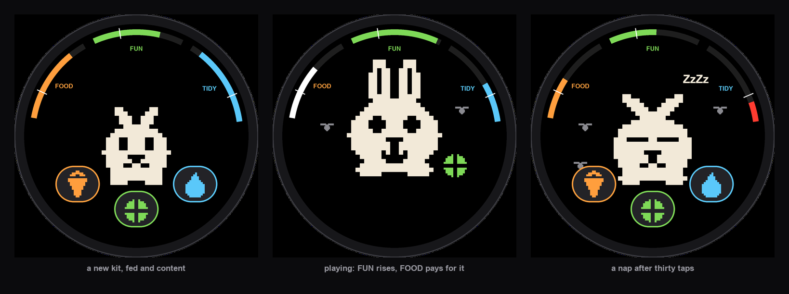

# nibble

A Tamagotchi rabbit for the Waveshare ESP32-S3-Touch-AMOLED-1.32
(466 x 466 round AMOLED, SH8601 panel over QSPI, CST820 touch).

A nibble is half a byte, and what a rabbit does all day.

Everything on screen is a picture, because it is meant for a child who cannot
read yet: the rabbit's face says what it needs, an icon on the button says
what that button gives, flies gather when it smells, and a gauge below its
notch turns red and breathes. It grows on care given rather than on time spent
holding it.

## Build and flash

    . ~/esp/esp-idf/export.sh
    idf.py build flash monitor

## Test the bunny logic on the Mac

    ./test.sh

`pet.c` has no LVGL and no ESP headers, so it compiles on the host. The
self-check runs in a second and fails if the decay, the actions, the nap or
the clamps break.

## Where things are

| File | Holds |
|---|---|
| `components/user_app/pet.c` | the state machine and all tuning numbers |
| `components/user_app/sprites.h` | the art, as ASCII, one character per pixel |
| `tools/gen_sprites.py` | builds `sprites.h`; edit a stage here, not by hand |
| `components/user_app/user_app.cpp` | screen layout and the one timer |
| `main/user_config.h` | the board pin map, from the Waveshare example |
| `docs/screens.png` | the picture at the top, drawn by `tools/mock_screen.py` |

Everything under that (display driver, touch, LVGL port) is the Waveshare
example, unchanged.

## The art

    python3 tools/gen_sprites.py            # rewrites sprites.h
    python3 tools/gen_sprites.py BABY YOUNG # also prints those stages to the terminal

Every feature of the rabbit is placed from its body ellipse, so a growth stage
is only a body size and an ear size. The `STAGES` table at the top holds all
three. Single pixels in `sprites.h` can still be edited by hand, but the
generator overwrites them.

## The screen, without a board

    /usr/bin/python3 tools/mock_screen.py   # rewrites docs/screens.png

The picture at the top is drawn, not photographed. The rabbit comes from
`sprites.h` and every number comes from `user_app.cpp`: the gauge angles, the
band width, the notch at 30, the scale of the art and where each thing sits.
Move something on the screen and move it here, then look at the result before
reaching for the USB cable. Needs Pillow, and the system python3 rather than
the ESP-IDF one.

## What the bunny shows you

Nothing on screen asks a child to read. A low need puts its own face on the
bunny and a picture of what it wants beside its head: a carrot, a ball, a drop
of water. The same picture is on the button, so the game is a match. Flies
gather as TIDY falls, one for every quarter of the gauge lost, so the first
arrives long before the notch and they all leave when you wash. The buttons
stay out of the way until the screen is touched.

Every answer costs a little on the next gauge: a meal makes a mess, a game
makes an appetite, a bath is no fun. The gauge that pays turns white for a
moment, so a child sees where the cost went. After thirty taps the bunny naps
for a minute, shuts its eyes, shows a ZzZz beside its head and takes no orders
until it wakes.

Apart from the ZzZz over a sleeping bunny, the three gauge words and the
restart question are the only text on the screen, and both are aimed at the
adult rather than the child.

## Growth

The pet grows on good deeds, not on time. A deed is answering a need the bunny
actually had, meaning the gauge was below `PET_WANTS` when you pressed the
button. Tapping a contented bunny earns nothing, and a need has to fall again
before it can be answered again, so the rate has a ceiling no amount of
tapping can beat. 16 deeds reach YOUNG, 65 reach ADULT.

This is deliberately not a clock. Paying for powered minutes rewards a child
for staying glued to the device and flattens the battery for nothing. Paying
for deeds rewards them for coming back. Against three short visits a day, the
simulation in the commit history gives YOUNG inside the first day and ADULT
on day two or three.

The catch is the missing clock: the bunny only gets hungry while the board is
powered. Left on with the screen asleep it works as described. Switched off,
it is frozen, and a child returning finds it exactly as they left it.

A baby gets hungry faster than an adult, so growing up makes the bunny easier
to keep.

## Tuning

All of the feel is in the block at the top of `pet.c`. A bar falls to zero in
(100 / rate) minutes. The defaults are set for a child: FOOD empties in 25
minutes, FUN in 30, TIDY in 40, and time away is capped at 90 minutes so
that a night off does not ruin the bunny. For a calmer, adult Tamagotchi pace,
divide the three rates by ten. `SIDE_COST` sets what every answer costs on the
next gauge, and `SLEEP_AFTER` how many taps buy a nap.

## Not built yet

- Wi-Fi and NTP. The board has no RTC, so time only passes while it is
  powered. Away time is capped by `MAX_CATCHUP_MIN` in `pet.c`.
- Sound. The board has an ES8311 codec and a speaker header.
- More animals. `gen_sprites.py` draws one rabbit; a second animal is a second
  set of drawing functions and a selector.
- Death.
- A tap game behind PLAY.
- Running on a battery. The cell header works, but GPIO18 is the power latch
  and this firmware never drives it, so the board drops as soon as the PWR
  button is released. See the vendor's 04_BATT_PWR_Test.
